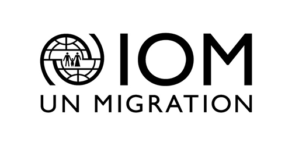
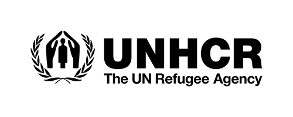
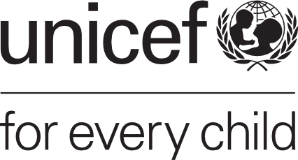

# EPPI-reviewer-map

The evidence gap map was produced within the framework of a rapid evidence assessment, which examines what works to protect children on the move. It provides a visual summary of the volume of evidence and its overall distribution in terms of positive outcomes, mixed outcomes and no evidence of change.

## Partners

